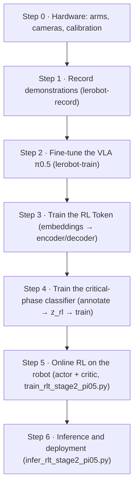

<h1 align="center">RL-Token-Pi05</h1>

<p align="center">
  <b>RL Token pipeline for the SO-101 arm</b><br>
  <sub>demonstration recording · π0.5 fine-tuning · RL Token training · critical-phase classifier · online RL · deployment</sub>
</p>

<p align="center">
  <a href="LICENSE"></a>
  
  
  
</p>

<p align="center"><b>English</b> | <a href="README.zh-CN.md">中文</a></p>

<details>
<summary>Contents</summary>

- [Pipeline](#pipeline)
- [Install](#install)
- [Step 0: hardware](#step-0-hardware)
- [Step 1: recording demonstrations](#step-1-recording-demonstrations)
- [Step 2: fine-tuning the VLA](#step-2-fine-tuning-the-vla)
- [Step 3: training the RL Token](#step-3-training-the-rl-token)
- [Step 4: training the critical-phase classifier](#step-4-training-the-critical-phase-classifier)
- [Step 5: online RL on the robot](#step-5-online-rl-on-the-robot)
- [Step 6: inference and deployment](#step-6-inference-and-deployment)
- [Configuration](#configuration)
- [Troubleshooting](#troubleshooting)
- [Acknowledgements](#acknowledgements)

</details>

<p align="center">
  
</p>

<p align="center"><i>The clip compares the VLA baseline on the left and the RL Token policy on the right on the same
task. Each panel is held at its outcome, so the left side stays on the failed attempt and the
right side on the successful one.</i></p>

RL-Token-Pi05 implements the full RL Token pipeline for the SO-101 arm: recording
demonstrations, fine-tuning π0.5, training the RL Token, training a critical-phase
classifier, online reinforcement learning on the real robot, and finally inference and
deployment. The commands below have been verified on a single SO-101 cell (two arms and
two cameras), so the flags can be used as they are, while the paths have to be replaced
with local ones.

> [!WARNING]
> From Step 4 onwards the scripts drive real hardware. The first run should consist of the
> dry-run preflight followed by a `vla_only` check, and the operator should keep a hand on the
> emergency stop throughout.

## Pipeline



The pipeline is strictly sequential: each step depends only on the artifacts produced by
the previous one. Step 4 is the only optional step, since the critical phase can also be
switched manually with the `c` key during a run.

## Install

```bash
git clone <this-repo> && cd RL-Token-Pi05
conda create -n rlt python=3.12 -y && conda activate rlt
pip install -e ./lerobot        # vendored lerobot fork containing pi05_rlt
pytest                          # CPU only
```

Installing is not required, because the in-repo source tree can be used directly through
`export PYTHONPATH=$PWD/lerobot/src:$PYTHONPATH`. Hugging Face downloads fail when a proxy
is configured, while every resource used here can be read from local files, so clearing
the proxy variables before starting is recommended:
`unset HTTP_PROXY HTTPS_PROXY ALL_PROXY http_proxy https_proxy all_proxy`.

## Step 0: hardware

The setup consists of two SO-101 arms and two cameras. The follower executes the motion,
while the leader is guided by the operator. The serial ports normally enumerate as
`/dev/ttyACM0` and `/dev/ttyACM1`, although the assignment can change after a reboot, so
it should be verified first.

```bash
lerobot-find-port
python so101_tools/check_follower_motors.py /dev/ttyACM0   # pings each motor and reports where the chain breaks
sudo bash so101_tools/fix_so101_permission.sh              # for "PermissionError: Errno 13"
lerobot-find-cameras opencv
bash so101_tools/run_so101_teleop.sh                       # teleoperation test, also clears stale processes holding the port
```

It is advisable to add `"fourcc": "MJPG"` and `"warmup_s": 3` to every camera entry. With
the default parameters a camera can open successfully and still deliver no frames. Camera
indices may change after a reboot, so a device path under `/dev/v4l/by-path/` should be
used when the assignment has to remain stable.

Each arm needs to be calibrated once, and again after any mechanical reassembly:

```bash
lerobot-calibrate --robot.type=so101_follower --robot.port=/dev/ttyACM0 --robot.id=so101_follower
lerobot-calibrate --teleop.type=so101_leader --teleop.port=/dev/ttyACM1 --teleop.id=so101_leader
```

## Step 1: recording demonstrations

Before recording, teleoperation is recommended in order to verify the motion directions
and joint units; recording can then proceed as follows.

```bash
lerobot-record \
  --robot.type=so101_follower --robot.port=/dev/ttyACM0 --robot.id=so101_follower \
  --robot.cameras='{"top": {"type": "opencv", "index_or_path": 0, "width": 640, "height": 480, "fps": 30, "fourcc": "MJPG", "warmup_s": 3}, "wrist": {"type": "opencv", "index_or_path": 3, "width": 640, "height": 480, "fps": 30, "fourcc": "MJPG", "warmup_s": 3}}' \
  --teleop.type=so101_leader --teleop.port=/dev/ttyACM1 --teleop.id=so101_leader \
  --dataset.repo_id=insert_bolt \
  --dataset.root=/path/to/lerobot/insert_bolt \
  --dataset.single_task="Insert the bolt into the hole" \
  --dataset.num_episodes=50 --dataset.episode_time_s=60 --dataset.reset_time_s=10 \
  --dataset.fps=30 --dataset.push_to_hub=false --display_data=true
```

A few points are worth observing while collecting data. The task string is reused by
later steps, so it must remain identical throughout. Unless `manual_positioning` is
enabled, the same start pose should be used for every episode. For a single task, 30 to
50 well-executed demonstrations are usually sufficient for fine-tuning. The dataset must
contain `meta/stats.json`, which online reinforcement learning uses for normalization and
without which the training script will not start. If the scene changes, for example
because a tool is replaced, additional data should be recorded and merged into the
dataset.

## Step 2: fine-tuning the VLA

π0.5 is a vision-language-action model: it takes camera images, proprioceptive state and
a language instruction as input, and produces actions as output. This step uses the
trainer shipped with lerobot.

```bash
lerobot-train \
  --dataset.repo_id=insert_bolt --dataset.root=/path/to/lerobot/insert_bolt \
  --dataset.video_backend=pyav \
  --policy.type=pi05 --policy.pretrained_path=/path/to/pi05_base \
  --policy.dtype=bfloat16 --policy.gradient_checkpointing=true \
  --policy.freeze_vision_encoder=false --policy.train_expert_only=false \
  --policy.device=cuda --policy.optimizer_lr=5e-4 \
  --policy.scheduler_warmup_steps=1000 --policy.scheduler_decay_steps=30000 \
  --policy.scheduler_decay_lr=1e-5 \
  --output_dir=outputs/pi05_bolt --job_name=pi05_bolt \
  --batch_size=1 --num_workers=8 --steps=30000 --log_freq=10 \
  --save_checkpoint=true --save_freq=1000 \
  --policy.push_to_hub=false --wandb.enable=false
```

Before the full run, a three-step trial is recommended, since it takes only a few minutes
and reveals weight-key or memory problems early. Several GPUs can be used by wrapping the
command in `torchrun`. The learning rate has to be set through `--policy.optimizer_lr`; if
`--optimizer.lr` is used instead, the trainer ignores it and the intended change does not
take effect.

Every saved step is a directory, and the later steps use the `pretrained_model/` inside
it:

```text
outputs/pi05_bolt/checkpoints/030000/pretrained_model/
├── config.json
├── model.safetensors
├── policy_preprocessor.json / policy_postprocessor.json   # normalization state
├── tokenizer/
└── train_config.json
```

The VLA only needs to reach the neighbourhood of the goal, because the final millimetres
are corrected by online reinforcement learning. A policy that cannot approach the goal
cannot be recovered by the later stages.

## Step 3: training the RL Token

The RL Token compresses the internal representation of the frozen VLA into a single
2048-dimensional vector, `z_rl`, which online reinforcement learning uses as its state.
The embeddings are computed first.

```bash
python scripts/precompute_pi05_embeddings.py \
  --pi05_path /path/to/pi05_bolt/checkpoints/030000/pretrained_model \
  --tokenizer_path /path/to/paligemma_tokenizer \
  --dataset_repo_id /path/to/lerobot/insert_bolt \
  --output_dir outputs/pi05_bolt_embeddings \
  --camera_map '{"top": "observation.images.top", "wrist": "observation.images.wrist"}' \
  --batch_size 16 --num_workers 4 --device cuda
```

The output consists of `prefix_out.mmap`, `prefix_mask.mmap` and `meta.json`. A single GPU
requires about 80 minutes for 50k frames. Since the work can be split by episode, running
it across several GPUs with `--shard_index/--shard_count` reduces that time considerably;
the resulting directories are then passed to the trainer as one comma-separated argument.

```bash
python scripts/train_rlt_stage1_pi05.py \
  --precomputed_path outputs/pi05_bolt_embeddings \
  --output_dir outputs/rlt_stage1_bolt \
  --steps 30000 --batch_size 64 --lr 1e-4 --warmup_steps 200 \
  --save_every 1000 --log_every 50 --num_workers 4 \
  --device cuda --gpus 0 --use_amp
```

`--gpus` accepts a single device, because the encoder and decoder are not split across
GPUs. The VLA, the embeddings, this checkpoint and the later online-RL configuration must
all come from the same VLA; mixing them shifts the distribution of `z_rl`, which degrades
the policy without raising an error.

The result is a single file, `outputs/rlt_stage1_bolt/best_checkpoint.pt`, and the later
scripts read that file.

## Step 4: training the critical-phase classifier

Online reinforcement learning learns only from the critical phase, that is, the part of
the motion that determines whether the task succeeds, such as the final alignment, the
insertion and the closing of the gripper. During a run this phase can be switched
manually with the `c` key, and the classifier automates that decision from `z_rl` and the
proprioceptive state. Since the classifier consumes `z_rl`, it has to follow Step 3.

`scripts/annotate_dataset.py` plays an episode with every camera side by side and records the
intervals that are marked. Intervals are written to `--annotations_out` after each episode and
again on exit, so a session can be stopped and resumed at any time, and episodes already
present in that file are skipped.

<p align="center">
  
</p>

<p align="center"><i>Each camera has its own panel, labelled underneath. The status line shows the episode, the
current frame and the intervals marked so far, and a closed interval is outlined in red while
the playhead is inside it. Playback continues with the next episode at the end of one.</i></p>

| Key | Action |
| --- | --- |
| `s` | start an interval at the current frame |
| `e` | close the interval at the current frame |
| `u` | undo the last interval |
| `space` | pause or resume |
| `←`, `→` | step one frame |
| `Shift` + `←`, `→` | jump 30 frames |
| `n` | next episode |
| `q` | save and quit |

On a machine without a display the tool falls back to a filmstrip: it renders each episode as
a sheet of numbered thumbnails and collects the intervals on the terminal instead.

```bash
# 1. annotate the intervals
python scripts/annotate_dataset.py \
  --dataset_path /path/to/lerobot/insert_bolt \
  --annotations_out annotations_bolt.json

# 2. compute z_rl for the sampled frames
python scripts/precompute_critical_zrl.py \
  --pi05_path /path/to/pi05_bolt/checkpoints/030000/pretrained_model \
  --tokenizer_path /path/to/paligemma_tokenizer \
  --rlt_checkpoint outputs/rlt_stage1_bolt/best_checkpoint.pt \
  --dataset_path /path/to/lerobot/insert_bolt \
  --annotations annotations_bolt.json \
  --output outputs/critical_zrl_bolt.npz \
  --pos_per_interval 40 --neg_per_episode 120 --batch_size 8 --device cuda

# 3. train the classifier
python scripts/train_critical_classifier.py \
  --precomputed_zrl outputs/critical_zrl_bolt.npz \
  --output outputs/critical_classifier_bolt.pt \
  --epochs 60 --batch_size 64 --lr 1e-3 \
  --hidden_dim 256 --num_layers 2 --val_episodes 6 --device cuda

# 4. review the metrics and choose thresholds
python scripts/evaluate_critical_classifier.py \
  --precomputed_zrl outputs/critical_zrl_bolt.npz \
  --classifier outputs/critical_classifier_bolt.pt --val_episodes 6 \
  --threshold_on 0.75 --threshold_off 0.45 --smooth_steps 4 --device cuda
```

<p align="center">
  
</p>

<p align="center"><i>Classifier check: one row per episode, with a frame from outside the hand-annotated critical
phase in red and three frames from inside it in green, and the classifier probability printed
under each frame. Two of the six checked episodes are shown; across all 30 intervals the mean
probability is 0.92 to 0.99 inside an interval and 0.002 to 0.09 outside it.</i></p>

The quality of the annotation sets the ceiling for the classifier, so the same criteria
should be applied to every episode. If the switching lag is noticeable, the intervals
should be re-annotated, since lowering a threshold only moves the problem elsewhere. A
classifier that performs poorly is not a safety concern, because a manually pressed `c`
key always takes priority.

## Step 5: online RL on the robot

The configuration template is `configs/stage2_pi05.json`, which is annotated and usually
requires only the paths to be edited.

```bash
python scripts/train_rlt_stage2_pi05.py --config configs/stage2_pi05.json
```

The recommended order is as follows. First run the dry-run preflight, which the template
enables by default and which checks paths, weights, cameras, normalization statistics and
pairing without touching hardware. Then run `vla_only` on the robot to confirm the camera
images, motion directions and joint units. After that, enable the Actor for a small number
of episodes, and only then start the real training run. Those switches can only be turned
on from the command line, so moving to hardware requires setting `"dry_run": false` in the
configuration; the form `--dry_run false` does not exist. A new experiment requires an
empty output directory, and resuming likewise requires a fresh empty directory together
with `--resume_from` pointing at the previous checkpoint.

Within an episode the following sequence takes place. The frozen π0.5 plans a 10-step
reference chunk, the RL Token encoder computes `z_rl`, the Actor, which is the network
that actually emits actions, takes over inside the critical phase and outputs an action
chunk. The follower executes it, the operator's y/n judgement provides the reward and is
written into the replay buffer, and the Critic, which estimates action values, updates
asynchronously in the background. The first `warmup_episodes` are executed by the VLA
alone, and only critical-phase data enters the replay buffer.

> [!TIP]
> The warmup phase matters a great deal. It fills the replay buffer with the VLA's own
> critical-phase behaviour, which gives the Critic its first learning signal and lets the
> Actor start from a competent policy instead of a random one. In practice `warmup_episodes`
> should be **more than 15**; the template default of 5 is enough to start the machinery but
> too small to be informative, and the first Actor updates then come from a buffer that is
> still nearly empty.

| Key | Action |
|---|---|
| `c` | switches the critical phase; one press starts replay recording, another stops it. Reset for every episode |
| `a` | switches Actor execution; the state persists across episodes |
| `p` | pre-episode positioning, requiring `manual_positioning`; positioning is never recorded |
| `h` / `s` | manual takeover / immediate hand-back to the policy |
| `f` / `g` | finish the episode early / discard the episode |
| `e` / `q` | emergency stop / quit |
| `y` / `n` | success or failure when prompted |

One round with an intervention looks like this. The episode starts and `a` enables the Actor
for the rest of the session; it takes over whenever the critical phase is active, which the
classifier sets with `--auto_critical` or the operator sets with `c`. The leader arm mirrors
the follower while the policy runs, so both arms move together. If the policy is heading for a
failure, pressing `h` switches to human control, and the follower mirrors the leader arm from
its current pose, so the corrections are applied without a jump. Pressing `h` again or `s`
hands control back to the policy, and `f` ends the round after the current chunk, after which
the y/n prompt records the reward and the next episode starts. Intervention steps are kept as
corrections, and the terminal reward is judged at that prompt rather than when control is
handed back.

To automate the critical phase as well, the flags
`--auto_critical --critical_classifier outputs/critical_classifier_bolt.pt` can be added,
in which case a manually pressed `c` key still takes priority.

The console prints only the episode counter and the necessary prompts. The full log is
written to `<output_dir>/train.log`, the metrics of each episode are recorded in
`rl_metrics.log`, and the curves can be viewed with
`python scripts/plot_rl_metrics.py <log> --live --port 8000`.

<p align="center">
  
</p>

<p align="center"><i>Curves of an online RL run, rendered by `plot_rl_metrics.py`.</i></p>

<p align="center">
  
</p>

<p align="center"><i>RL Token checkpoints taken at 5 and 50 training epochs on the same task: the motion converges
as training goes on.</i></p>

## Step 6: inference and deployment

The inference script runs the trained policy on the robot without performing any learning
and without updating weights. It reads its own configuration file,
`configs/infer_pi05.json`, where the paths, cameras and serial ports are set together with
the actor checkpoint to load (the `resume_from` key, pointing at the `final_checkpoint.pt`
produced in Step 5). Once the file is filled in, the script is started directly:

```bash
python scripts/infer_rlt_stage2_pi05.py --config configs/infer_pi05.json
```

The first run should keep `"dry_run": true`, which only performs the checks and touches no
hardware; set it to `false` afterwards. The frozen π0.5 base alone is not a trained policy,
so the script exits with an error when `resume_from` is empty.

The commonly used options are the following. `--vla_only` runs the VLA alone for a first
check. `--record_dataset` records the rollouts as a dataset that can be used for further
training. `--leader_mirror` mirrors the follower pose onto the leader. `--inference_score`
asks for a y/n judgement after each episode in order to track the success rate, and
`--save_debug_obs` exports per-step state/target/sent CSV files. Before starting, the
script performs the camera preflight and the pairing checks, and stops if any of them
fails.

## Configuration

Training uses `configs/stage2_pi05.json` and inference uses `configs/infer_pi05.json`; both
are annotated. The entries in the training configuration that usually need editing are
listed below.

| Key | Meaning |
|---|---|
| `pi05_path` | the fine-tuned π0.5 directory, that is, `pretrained_model/` |
| `rlt_checkpoint` | the single-file `.pt` produced in Step 3 |
| `tokenizer_path` | tokenizer directory; a local copy should be used on offline machines |
| `stats_path` | the dataset's `meta/stats.json`; when left empty it is read from the checkpoint |
| `task` | the language instruction, which must match `single_task` in the dataset |
| `follower_port`, `leader_port` | serial ports of the two arms |
| `cameras`, `camera_map` | camera devices and the model input each of them feeds |
| `control_fps`, `steps_per_episode`, `max_episodes` | episode pacing |
| `warmup_episodes` | pure-VLA warmup before the Actor starts; more than 15 is recommended |
| `output_dir` | output directory; a new experiment requires an empty one |
| `resume_from` | training only: an existing checkpoint to resume from, empty for a new run |
| `dry_run` | must be `true` for the first run |

The remaining entries, including the number of warmup episodes, the Actor threshold, the
thresholds and smoothing of the automatic critical phase, the HIL settings and the network
shapes, are documented in the template itself. Every option of the deployment script, with its
default value and the cases where it needs changing, is listed in [CONFIG.md](CONFIG.md).

## Troubleshooting

The following table covers the problems encountered most often.

| Symptom | Action |
|---|---|
| `PermissionError` on the serial port | run `sudo bash so101_tools/fix_so101_permission.sh` |
| a motor does not respond | run `python so101_tools/check_follower_motors.py /dev/ttyACM0` |
| a camera opens but returns no frames | add `"fourcc": "MJPG"` and `"warmup_s": 3` |
| a learning-rate change has no effect | use `--policy.optimizer_lr` |
| the checkpoint does not match the VLA, RL Token or stats | all of them must come from the same VLA; retrain them as a set |
| the shards disagree on dimensions | check `seq_len` and `vlm_hidden_dim` in each shard's `meta.json` |
| the `f` key has no effect | a y/n prompt is waiting; answer y/n/r/q first |

Tests are run with `pytest`, which requires only a CPU, and the contracts of the online RL
stage are covered by `pytest tests/test_train_rlt_stage2_pi05.py -v`.

## Acknowledgements

This work was carried out with the venue and equipment support of ZTE Corporation.

Thanks to the Physical Intelligence team for open-sourcing π0.5, the VLA this repository
fine-tunes.

Thanks to [@Teddy-Liao](https://github.com/Teddy-Liao), engineer on the ZTE Robotics team and
collaborator on this repository, for the help with the hardware and the experiments.

<p align="center">
  
</p>

### Hiring

The ZTE Robotics team works on embodied intelligence for robot manipulation, and recruits for
manipulation, task planning and motion control positions.

- ZTE Robotics engineer and repository collaborator: [@Teddy-Liao](https://github.com/Teddy-Liao)
- Repository author: [@Zhengsw03](https://github.com/Zhengsw03)

If this repository is useful for your work, a star is appreciated.

## License

This project is released under the Apache License 2.0; see [LICENSE](LICENSE) and
[NOTICE](NOTICE). The `lerobot/` directory is a modified copy of
[huggingface/lerobot](https://github.com/huggingface/lerobot) distributed under the same
license.

The method is described in *RL Token: Bootstrapping Online RL with Vision-Language-Action
Models* (arXiv:2604.23073); the project page is <https://pi.website/research/rlt>.
