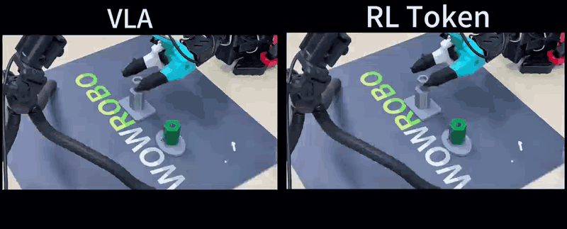
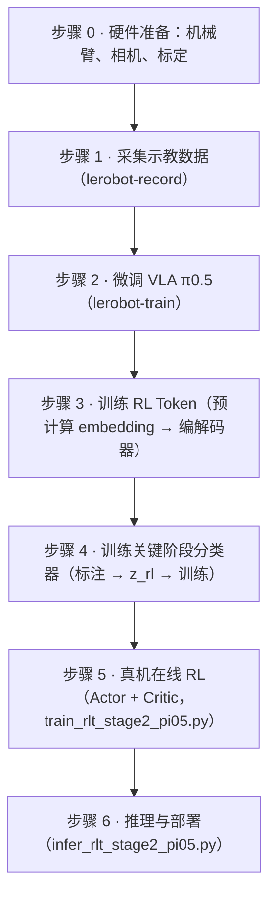
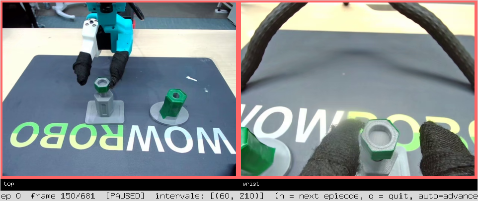
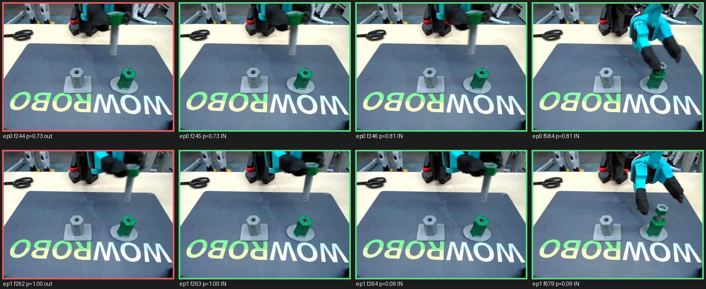
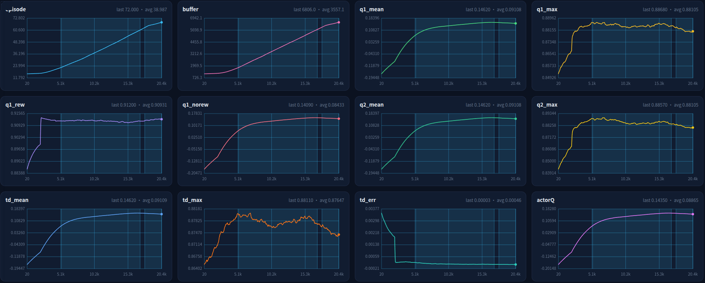
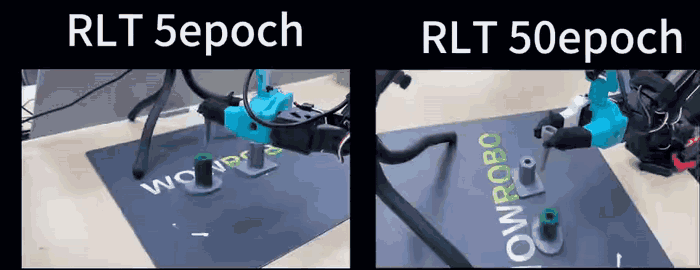

<h1 align="center">RL-Token-Pi05</h1>

<p align="center">
  <b>SO-101 机械臂上的 RL Token 全流程</b><br>
  <sub>采集示教 · 微调 π0.5 · 训练 RL Token · 关键阶段分类器 · 真机在线 RL · 推理部署</sub>
</p>

<p align="center">
  <a href="LICENSE"></a>
  
  
  
</p>

<p align="center"><a href="README.md">English</a> | <b>中文</b></p>

<details>
<summary>目录</summary>

- [流程](#流程)
- [安装](#安装)
- [步骤 0：硬件准备](#步骤-0硬件准备)
- [步骤 1：采集示教数据](#步骤-1采集示教数据)
- [步骤 2：微调 VLA](#步骤-2微调-vla)
- [步骤 3：训练 RL Token](#步骤-3训练-rl-token)
- [步骤 4：训练关键阶段分类器](#步骤-4训练关键阶段分类器)
- [步骤 5：真机在线 RL](#步骤-5真机在线-rl)
- [步骤 6：推理与部署](#步骤-6推理与部署)
- [配置项](#配置项)
- [出问题怎么办](#出问题怎么办)
- [致谢](#致谢)

</details>

<p align="center">
  
</p>

<p align="center"><i>视频把 VLA 基线与 RL Token 策略在同一任务上的表现并排对比，两块画面分别在自己的结论时刻定格：
左侧停在失败的尝试上，右侧停在成功的尝试上。</i></p>

RL-Token-Pi05 提供 SO-101 机械臂上 RL Token 的完整实现流程：采集示教数据、微调 π0.5、训练
RL Token、训练关键阶段分类器、真机在线强化学习，以及推理与部署。文中的命令均在一台 SO-101
工位（两条机械臂、两路相机）上验证过，参数可以直接使用，路径需替换为实际路径。

> [!WARNING]
> 从步骤 4 开始脚本会驱动真实机械臂。首次运行应先执行 dry run 预检，再用 `vla_only` 验证，
> 整个过程中操作者应始终将手放在急停开关上。

## 流程



整个流程严格串行，每一步只依赖上一步的产物。步骤 4 是唯一可选的环节，如果不训练分类器，可以在
运行时用 `c` 键手动切换关键阶段。

## 安装

```bash
git clone <本仓库> && cd RL-Token-Pi05
conda create -n rlt python=3.12 -y && conda activate rlt
pip install -e ./lerobot        # 内置的 lerobot fork，含 pi05_rlt
pytest                          # 仅需 CPU
```

如果不希望安装到环境中，也可以直接使用仓库内的源码：`export PYTHONPATH=$PWD/lerobot/src:$PYTHONPATH`。
环境中存在代理时 Hugging Face 下载会失败，而本项目所有资源都可以使用本地文件，因此建议在开始
工作前先执行 `unset HTTP_PROXY HTTPS_PROXY ALL_PROXY http_proxy https_proxy all_proxy`。

## 步骤 0：硬件准备

工位由两条 SO-101 机械臂和两路相机组成，其中从臂负责执行动作，主臂由操作者手动引导。串口通常
枚举为 `/dev/ttyACM0` 与 `/dev/ttyACM1`，但重启后可能互换，因此需要先确认：

```bash
lerobot-find-port
python so101_tools/check_follower_motors.py /dev/ttyACM0   # 从臂电机自检，会指出断点位置
sudo bash so101_tools/fix_so101_permission.sh              # 串口报 Errno 13 时使用
lerobot-find-cameras opencv
bash so101_tools/run_so101_teleop.sh                       # 遥操作试跑，同时清理占用端口的残留进程
```

相机配置建议为每路添加 `"fourcc": "MJPG"` 与 `"warmup_s": 3`。使用默认参数时，相机可能出现能够
打开却读不到画面帧的情况。相机编号在重启后可能发生变化，若需要固定设备，应使用
`/dev/v4l/by-path/` 下的设备路径。

每条机械臂需要标定一次，机械结构重新装配后应重新标定：

```bash
lerobot-calibrate --robot.type=so101_follower --robot.port=/dev/ttyACM0 --robot.id=so101_follower
lerobot-calibrate --teleop.type=so101_leader --teleop.port=/dev/ttyACM1 --teleop.id=so101_leader
```

## 步骤 1：采集示教数据

正式录制前，建议先用遥操作确认动作方向与关节单位，确认无误后再开始采集：

```bash
lerobot-record \
  --robot.type=so101_follower --robot.port=/dev/ttyACM0 --robot.id=so101_follower \
  --robot.cameras='{"top": {"type": "opencv", "index_or_path": 0, "width": 640, "height": 480, "fps": 30, "fourcc": "MJPG", "warmup_s": 3}, "wrist": {"type": "opencv", "index_or_path": 3, "width": 640, "height": 480, "fps": 30, "fourcc": "MJPG", "warmup_s": 3}}' \
  --teleop.type=so101_leader --teleop.port=/dev/ttyACM1 --teleop.id=so101_leader \
  --dataset.repo_id=insert_bolt \
  --dataset.root=/path/to/lerobot/insert_bolt \
  --dataset.single_task="Insert the bolt into the hole" \
  --dataset.num_episodes=50 --dataset.episode_time_s=60 --dataset.reset_time_s=10 \
  --dataset.fps=30 --dataset.push_to_hub=false --display_data=true
```

采集时需要注意以下几点。任务文本在后续步骤中会反复使用，必须保持一致；除启用
`manual_positioning` 外，建议每集保持相同的起始位姿；对于单一任务，30 至 50 条质量良好的示教
数据通常已足够完成微调。数据集必须包含 `meta/stats.json`，在线强化学习依赖它进行归一化，缺少
该文件将无法启动。如果场景发生变化，例如更换了工具，应补充采集数据后再行合并。

## 步骤 2：微调 VLA

π0.5 是视觉-语言-动作模型，输入为相机画面、本体状态与语言指令，输出为动作序列。本步骤使用
lerobot 自带的训练器：

```bash
lerobot-train \
  --dataset.repo_id=insert_bolt --dataset.root=/path/to/lerobot/insert_bolt \
  --dataset.video_backend=pyav \
  --policy.type=pi05 --policy.pretrained_path=/path/to/pi05_base \
  --policy.dtype=bfloat16 --policy.gradient_checkpointing=true \
  --policy.freeze_vision_encoder=false --policy.train_expert_only=false \
  --policy.device=cuda --policy.optimizer_lr=5e-4 \
  --policy.scheduler_warmup_steps=1000 --policy.scheduler_decay_steps=30000 \
  --policy.scheduler_decay_lr=1e-5 \
  --output_dir=outputs/pi05_bolt --job_name=pi05_bolt \
  --batch_size=1 --num_workers=8 --steps=30000 --log_freq=10 \
  --save_checkpoint=true --save_freq=1000 \
  --policy.push_to_hub=false --wandb.enable=false
```

正式训练前，建议先将 `--steps` 设为 3 试跑一次，通常只需几分钟即可发现权重键名或显存方面的
问题。多卡训练可以用 `torchrun` 包装。学习率必须通过 `--policy.optimizer_lr` 设置；如果写成
`--optimizer.lr`，训练器会忽略该参数，修改不会生效。

每个保存点对应一个目录，后续步骤使用其中的 `pretrained_model/`：

```text
outputs/pi05_bolt/checkpoints/030000/pretrained_model/
├── config.json
├── model.safetensors
├── policy_preprocessor.json / policy_postprocessor.json   # 归一化状态
├── tokenizer/
└── train_config.json
```

VLA 只需能够接近目标区域即可，最后几毫米由在线强化学习修正；如果策略连目标附近都无法到达，
后续训练也无法弥补。

## 步骤 3：训练 RL Token

RL Token 将冻结 VLA 的内部表示压缩为一个 2048 维向量 `z_rl`，在线强化学习以它作为状态表示。
首先计算 embedding：

```bash
python scripts/precompute_pi05_embeddings.py \
  --pi05_path /path/to/pi05_bolt/checkpoints/030000/pretrained_model \
  --tokenizer_path /path/to/paligemma_tokenizer \
  --dataset_repo_id /path/to/lerobot/insert_bolt \
  --output_dir outputs/pi05_bolt_embeddings \
  --camera_map '{"top": "observation.images.top", "wrist": "observation.images.wrist"}' \
  --batch_size 16 --num_workers 4 --device cuda
```

产物包括 `prefix_out.mmap`、`prefix_mask.mmap` 与 `meta.json`。单卡处理 5 万帧约需 80 分钟；
由于该步骤可以按 episode 切分，使用 `--shard_index/--shard_count` 在多卡上并行执行可显著缩短
耗时，之后将各目录以逗号拼接后传给训练器。

```bash
python scripts/train_rlt_stage1_pi05.py \
  --precomputed_path outputs/pi05_bolt_embeddings \
  --output_dir outputs/rlt_stage1_bolt \
  --steps 30000 --batch_size 64 --lr 1e-4 --warmup_steps 200 \
  --save_every 1000 --log_every 50 --num_workers 4 \
  --device cuda --gpus 0 --use_amp
```

`--gpus` 只接受单块显卡，因为 encoder 与 decoder 不拆分到多卡。VLA、embedding、该 checkpoint
以及后续的在线强化学习配置必须来自同一个 VLA；混用会使 `z_rl` 的分布发生偏移，导致策略性能
下降且不会报错。

训练产物为单文件 `outputs/rlt_stage1_bolt/best_checkpoint.pt`，后续脚本均读取该文件。

## 步骤 4：训练关键阶段分类器

在线强化学习只从关键阶段学习，也就是真正决定任务成败的那段动作，例如最终对准、插入以及闭合
夹爪。运行时可以按 `c` 键手动切换，分类器则利用 `z_rl` 与本体状态自动完成这一判断。由于分类器
以 `z_rl` 为输入，必须安排在步骤 3 之后。

`scripts/annotate_dataset.py` 会把一集的多个相机画面并排播放，并记录标出的区间。结果在每
一集结束后写入 `--annotations_out`，退出时还会再写一次，因此随时可以中断再继续，文件里
已经有的集会自动跳过。

<p align="center">
  
</p>

<p align="center"><i>每个相机一块画面，画面下方是相机名。状态栏显示当前集数、帧号以及已经标好的区间；区间闭合
后，播放头落在其中时画面会被红框框出。一集播完自动进入下一集。</i></p>

| 按键 | 作用 |
| --- | --- |
| `s` | 在当前帧开始一个区间 |
| `e` | 在当前帧结束区间 |
| `u` | 撤销上一个区间 |
| `space` | 暂停 / 继续 |
| `←`、`→` | 后退 / 前进一帧 |
| `Shift` + `←`、`→` | 后退 / 前进 30 帧 |
| `n` | 下一集 |
| `q` | 保存并退出 |

没有显示器时会退回胶片模式：把每一集渲染成带帧号的缩略图拼图，在终端里填写区间。

```bash
# 1. 标注关键区间
python scripts/annotate_dataset.py \
  --dataset_path /path/to/lerobot/insert_bolt \
  --annotations_out annotations_bolt.json

# 2. 计算采样帧的 z_rl
python scripts/precompute_critical_zrl.py \
  --pi05_path /path/to/pi05_bolt/checkpoints/030000/pretrained_model \
  --tokenizer_path /path/to/paligemma_tokenizer \
  --rlt_checkpoint outputs/rlt_stage1_bolt/best_checkpoint.pt \
  --dataset_path /path/to/lerobot/insert_bolt \
  --annotations annotations_bolt.json \
  --output outputs/critical_zrl_bolt.npz \
  --pos_per_interval 40 --neg_per_episode 120 --batch_size 8 --device cuda

# 3. 训练分类器
python scripts/train_critical_classifier.py \
  --precomputed_zrl outputs/critical_zrl_bolt.npz \
  --output outputs/critical_classifier_bolt.pt \
  --epochs 60 --batch_size 64 --lr 1e-3 \
  --hidden_dim 256 --num_layers 2 --val_episodes 6 --device cuda

# 4. 查看指标并确定阈值
python scripts/evaluate_critical_classifier.py \
  --precomputed_zrl outputs/critical_zrl_bolt.npz \
  --classifier outputs/critical_classifier_bolt.pt --val_episodes 6 \
  --threshold_on 0.75 --threshold_off 0.45 --smooth_steps 4 --device cuda
```

<p align="center">
  
</p>

<p align="center"><i>分类器核验图：每行一个回合，红框是人工标注的关键阶段之外的一帧，绿框是阶段内的三帧，每帧下方
是该帧的分类概率。这里展示 6 个核验回合中的 2 行；整批 30 个区间的统计为区间内平均概率
0.92~0.99、区间外 0.002~0.09。</i></p>

标注质量决定了分类器的性能上限，因此各集的标注标准应保持一致。如果开关切换的滞后明显，应重新
标注，单纯调低阈值只是把问题转移到其他位置。分类器效果不理想不会带来风险，因为手动按下的 `c`
键始终优先。

## 步骤 5：真机在线 RL

配置文件模板为 `configs/stage2_pi05.json`，其中带有注释，通常只需修改路径：

```bash
python scripts/train_rlt_stage2_pi05.py --config configs/stage2_pi05.json
```

建议按以下顺序推进：先执行 dry run，该模式在模板中默认开启，只检查路径、权重、相机、归一化
统计与配套关系，不访问硬件；随后在真机上运行 `vla_only`，确认相机画面、动作方向与关节单位
正确；然后启用 Actor 运行少量回合；最后开始正式训练。上述开关只能在命令行打开，若要连接真机，
需要在配置中将 `"dry_run"` 改为 `false`，命令行不支持 `--dry_run false` 的写法。新实验需要空的
输出目录，续训同样需要新的空目录，并通过 `--resume_from` 指向原有 checkpoint。

一个回合内的流程如下：冻结的 π0.5 先规划出 10 步参考动作，RL Token 编码器计算 `z_rl`，Actor
（实际输出动作的网络）在关键阶段接管并输出动作块，从臂执行之后由操作者用 y/n 判定成败并写入
回放缓冲，Critic（评估动作价值的网络）在后台异步更新。前 `warmup_episodes` 个回合由纯 VLA
执行，只有关键阶段的数据进入回放缓冲。

> [!TIP]
> 预热阶段非常关键：它用 VLA 自己在关键阶段的表现把回放缓冲填起来，Critic 的第一批学习信号
> 来自这里，Actor 也才能从一个像样的策略出发，而不是从随机的动作开始。实践上 `warmup_episodes`
> **建议大于 15**；模板默认的 5 只够把流程跑起来，样本量太小，最初的几次 Actor 更新会来自一个
> 几乎空的缓冲。

| 按键 | 作用 |
|---|---|
| `c` | 切换关键阶段，按一次开始记录回放，再按一次停止。每个回合会重置 |
| `a` | 切换 Actor 执行，状态跨回合保持 |
| `p` | 回合前摆位（需启用 `manual_positioning`），摆位过程不会写入回放 |
| `h` / `s` | 人工接管 / 立即交还策略 |
| `f` / `g` | 提前结束本回合 / 丢弃本回合 |
| `e` / `q` | 急停 / 退出 |
| `y` / `n` | 弹窗提示时判定成功 / 失败 |

一次带人工介入的回合大致如下：回合开始后按一次 `a` 启用 Actor（该状态跨回合保持），关键阶段处于
激活状态时 Actor 才会接管，关键阶段由分类器（`--auto_critical`）或手动按 `c` 决定；策略运行期间
主臂跟随从臂，两条臂一起运动。发现策略即将失败时按 `h` 切换到人工控制，从臂从当前位姿开始跟随
主臂，因此修正动作不会出现跳变；再按一次 `h` 或按 `s` 把控制交还策略；按 `f` 在当前动作块结束后
结束本回合，随后在 y/n 提示中判定成败，下一回合随之开始。介入过程会作为修正动作保留，成败在回合
结束的提示中判定，而不是在交还控制时判定。

若希望关键阶段也自动切换，可以加入
`--auto_critical --critical_classifier outputs/critical_classifier_bolt.pt`，此时手动按下的 `c` 键
仍然优先。

控制台只输出回合计数与必要提示，完整日志写入 `<output_dir>/train.log`，每个回合的指标记录在
`rl_metrics.log`，可以使用 `python scripts/plot_rl_metrics.py <日志路径> --live --port 8000`
查看训练曲线。

<p align="center">
  
</p>

<p align="center"><i>`plot_rl_metrics.py` 渲染的一次在线 RL 运行曲线。</i></p>

<p align="center">
  
</p>

<p align="center"><i>RL Token 训练到 5 轮与 50 轮时在同一任务上的对照：随着训练推进，动作逐渐收敛。</i></p>

## 步骤 6：推理与部署

推理脚本在真机上运行训练好的策略，过程中不进行学习，也不会更新权重。它的配置文件是
`configs/infer_pi05.json`，需要填写的内容包括各路径、相机与串口，以及要加载的 actor 存档
（`resume_from` 键，指向步骤 5 产出的 `final_checkpoint.pt`）。配置填好后直接启动即可：

```bash
python scripts/infer_rlt_stage2_pi05.py --config configs/infer_pi05.json
```

首次运行请保持 `"dry_run": true`，脚本只做检查而不访问硬件；确认无误后改为 `false`。只提供 π0.5
基座并不构成一个训练好的策略，因此 `resume_from` 为空时脚本会直接报错退出。

常用参数包括：`--vla_only` 仅运行 VLA，用于首次检查；`--record_dataset` 将 rollout 录制为可以
直接用于再训练的数据集；`--leader_mirror` 把从臂位姿镜像到主臂；`--inference_score` 在每个回合
结束后询问 y/n 以统计成功率；`--save_debug_obs` 导出逐步的 state/target/sent CSV 文件。启动前
脚本会完成相机预检与配套关系校验，任一项不通过即停止运行。

## 配置项

训练用的配置文件是 `configs/stage2_pi05.json`，推理用的是 `configs/infer_pi05.json`，两者都带
注释。训练配置中通常需要修改的配置项如下：

| 键 | 说明 |
|---|---|
| `pi05_path` | 微调后的 π0.5 目录，即 `pretrained_model/` |
| `rlt_checkpoint` | 步骤 3 生成的单文件 `.pt` |
| `tokenizer_path` | tokenizer 目录，离线机器应使用本地副本 |
| `stats_path` | 数据集的 `meta/stats.json`，留空则从 checkpoint 中读取 |
| `task` | 语言指令，需与数据集中的 `single_task` 一致 |
| `follower_port`、`leader_port` | 两条机械臂的串口 |
| `cameras`、`camera_map` | 相机设备及其对应的模型输入 |
| `control_fps`、`steps_per_episode`、`max_episodes` | 回合节奏 |
| `warmup_episodes` | Actor 启动前的纯 VLA 预热回合数，建议大于 15 |
| `output_dir` | 输出目录，新实验需要空目录 |
| `resume_from` | 续训时指向既有 checkpoint，留空表示新训练（仅训练配置） |
| `dry_run` | 首次运行必须为 `true` |

其余配置项，包括预热回合数、Actor 启用门槛、自动关键阶段的阈值与平滑参数、HIL 相关设置以及
网络结构等，在模板中均有注释说明。部署脚本的每个参数、默认值以及需要修改的情形见
[CONFIG.zh-CN.md](CONFIG.zh-CN.md)。

## 出问题怎么办

遇到问题时可以先对照下表：

| 现象 | 处理方式 |
|---|---|
| 串口报 `PermissionError` | 执行 `sudo bash so101_tools/fix_so101_permission.sh` |
| 某个电机没有响应 | 执行 `python so101_tools/check_follower_motors.py /dev/ttyACM0` |
| 相机能打开但读不到帧 | 添加 `"fourcc": "MJPG"` 与 `"warmup_s": 3` |
| 修改学习率后不生效 | 改用 `--policy.optimizer_lr` |
| 提示 checkpoint 与 VLA / RL Token / stats 不配套 | 三者必须同源，需按同一份 VLA 重新训练 |
| 分片缓存提示维度不一致 | 检查各分片 `meta.json` 中的 `seq_len` 与 `vlm_hidden_dim` |
| 按 `f` 没有反应 | y/n 弹窗正在等待输入，先按 y/n/r/q |

运行测试使用 `pytest`（仅需 CPU），在线强化学习的契约测试可用
`pytest tests/test_train_rlt_stage2_pi05.py -v`。

## 致谢

本工作在中兴通讯（ZTE）提供的场地与设备支持下完成。

感谢 Physical Intelligence 团队开源 π0.5，本仓库微调的 VLA 即来自该项目。

感谢中兴通讯机器人团队（ZTE Robotics）工程师、本仓库协作者
[@Teddy-Liao](https://github.com/Teddy-Liao) 在硬件搭建与实验过程中给予的帮助。

<p align="center">
  
</p>

### 招聘

中兴通讯机器人团队（ZTE Robotics）从事具身智能与机器人操作方向的研究，正在招聘 manipulation、
任务规划、运控等岗位。

- 中兴通讯机器人团队工程师、本仓库协作者：[@Teddy-Liao](https://github.com/Teddy-Liao)
- 本仓库作者：[@Zhengsw03](https://github.com/Zhengsw03)

如果这个仓库对你有帮助，欢迎点个 star。

## 许可证

本项目采用 Apache License 2.0，详见 [LICENSE](LICENSE) 与 [NOTICE](NOTICE)。`lerobot/` 目录是
[huggingface/lerobot](https://github.com/huggingface/lerobot) 的修改副本，按同一许可证分发。

方法来自 *RL Token: Bootstrapping Online RL with Vision-Language-Action Models*
（arXiv:2604.23073），项目主页为 <https://pi.website/research/rlt>。
